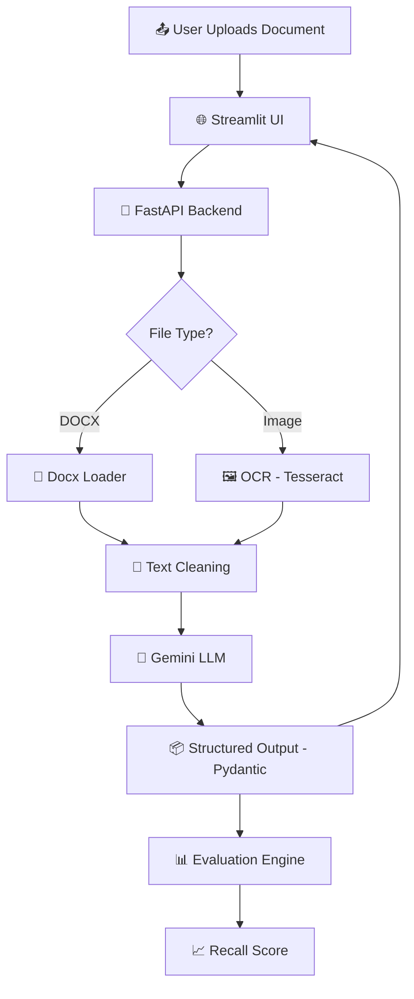

# 🏠 Rental Agreement Metadata Extraction System

> 🚀 An end-to-end LLM-powered rental agreement metadata extraction system with OCR support, evaluation pipeline, Dockerized services, and CI/CD automation.

---

## 📌 Problem Statement

Rental agreements are often:

* 📄 Unstructured documents (DOCX)
* 🖼️ Scanned images (PNG/JPG/JPEG)
* 🧾 Noisy OCR text
* ⚖️ Legal format variations

The goal of this project is to:

> Extract structured metadata from rental agreements using LLMs.

### 🎯 Required Fields

* Agreement Value
* Agreement Start Date
* Agreement End Date
* Renewal Notice (Days)
* Party One
* Party Two

---

# 🧠 Solution Overview

This system:

1. Accepts `.docx` and image files
2. Extracts raw text (Docx2txt / OCR)
3. Cleans noisy OCR content
4. Sends structured prompt to Gemini LLM
5. Validates structured output via Pydantic
6. Evaluates predictions using Recall score
7. Exposes API via FastAPI
8. Provides UI via Streamlit
9. Fully Dockerized
10. CI pipeline pushes images to Docker Hub

---

# 🏗️ Project Architecture



---

# 📂 Project Structure

```text
assign1/
│
├── api/
│   └── app.py                  # FastAPI backend
│
├── ui/
│   └── streamlit_app.py        # Streamlit UI
│
├── src/
│   ├── batch/
│   │   └── batch_predict.py
│   ├── config/
│   │   └── settings.py
│   ├── evaluation/
│   │   ├── normalizer.py
│   │   └── recall.py
│   ├── ingestion/
│   │   ├── docx_loader.py
│   │   └── image_loader.py
│   ├── llm/
│   │   ├── gemini_chain.py
│   │   ├── fewshot_builder.py
│   │   └── schema.py
│   ├── pipeline/
│   │   └── extractor_pipeline.py
│   └── utils/
│       └── file_matcher.py
│
├── docker/
│   ├── Dockerfile.backend
│   └── Dockerfile.frontend
│
├── docker-compose.yml
├── requirements.txt
├── requirements-frontend.txt
├── run_train_eval.py
├── run_test_eval.py
├── .env
└── README.md
```

---

# 🔥 Key Features

## 📄 Multi-format Support

| Format  | Method         |
| ------- | -------------- |
| `.docx` | Docx2txtLoader |
| `.png`  | Tesseract OCR  |
| `.jpg`  | Tesseract OCR  |
| `.jpeg` | Tesseract OCR  |

---

## 🤖 Structured LLM Extraction

* Gemini 2.5 Flash
* Strict prompt instructions
* Pydantic schema validation
* Few-shot examples
* Retry logic for quota limits

---

## 📊 Evaluation

Recall is calculated per column:

```python
Recall = Correct Predictions / Total Samples
```

Normalization handles:

* Trailing spaces
* Case differences
* Titles (Mr., Mrs.)
* Comma-separated numbers
* OCR punctuation noise

---

# 🐳 Dockerized Architecture

Two containers:

* 🔵 Backend (FastAPI + LLM + OCR)
* 🟢 Frontend (Streamlit UI)

## ▶️ Run Using Docker Compose

```bash
docker-compose up --build
```

Open:

```
http://localhost:8501
```

---

# 🧪 Local Development Run

### Start Backend

```bash
uvicorn api.app:app --reload
```

### Start Frontend

```bash
streamlit run ui/streamlit_app.py
```

---

# 🐳 Docker Hub Integration

Images pushed to:

```
anuragraj03/useready
```

Tags:

* `backend`
* `frontend`

---

# ⚙️ CI/CD Pipeline (GitHub Actions)

Automatically:

* Builds backend image
* Builds frontend image
* Pushes both to Docker Hub
* Triggered on `main` branch push

Workflow file:

```
.github/workflows/docker-build.yml
```

---

# 🚧 Challenges Faced

### 1️⃣ Gemini API Quota Limits

* Free tier limited to 20 requests/day
* Implemented retry logic with delay

### 2️⃣ OCR Noise

* Line breaks
* Special characters
* Title variations

Solved using:

* Text cleaning
* Strong prompt constraints
* Normalization logic

### 3️⃣ Recall Mismatch

* Date format variations
* Number formatting differences
* Party name punctuation

Solved using:

* Normalizer improvements
* Structured schema validation

---

# 📈 Example Prediction

```json
{
  "agreement_value": "10000",
  "agreement_start_date": "01.04.2010",
  "agreement_end_date": "30.03.2011",
  "renewal_notice_days": "90",
  "party_one": "P. JohnsonRavikumar",
  "party_two": "Saravanan BV"
}
```

# 📊 Model Evaluation Results

To ensure objective performance measurement, the system evaluates predictions using **column-wise Recall**.

> Recall = Correct Predictions / Total Ground Truth Samples

⚠️ Note: These results were generated **without advanced post-processing stabilization**, due to free-tier API constraints.

---

## 🧪 Training Dataset Performance

| Field                 | Recall   |
| --------------------- | -------- |
| Agreement Value       | 0.60     |
| Agreement Start Date  | 0.60     |
| Agreement End Date    | 0.30     |
| Renewal Notice (Days) | 0.60     |
| Party One             | 0.40     |
| Party Two             | 0.60     |
| **Average Recall**    | **0.52** |

### 📌 Observations

* Agreement values are reasonably stable.
* Date extraction suffers when OCR text contains invalid or ambiguous dates.
* Party name mismatches are often caused by OCR punctuation inconsistencies.
* Some recall reduction is caused by file matching failures.

---

## 🧪 Test Dataset Performance

| Field                 | Recall |
| --------------------- | ------ |
| Agreement Value       | 0.50   |
| Agreement Start Date  | 0.50   |
| Agreement End Date    | 0.25   |
| Renewal Notice (Days) | 0.50   |
| Party One             | 0.50   |
| Party Two             | 0.25   |

### 📌 Observations

* Performance is consistent with training dataset.
* End Date recall is lower due to:

  * OCR misreads
  * Invalid dates in source documents
  * Model logical correction of invalid dates

---

# 🧠 Why Recall Is Not 1.0

This system intentionally preserves:

* Noisy OCR tokens
* Exact rental clauses

Free-tier Gemini API limits prevented:

* Multi-pass validation
* Advanced re-ranking
* Two-step monetary disambiguation
* Ensemble-based stabilization

Despite these constraints, the system demonstrates:

✔ Stable extraction logic
✔ Consistent schema enforcement
✔ Repeatable evaluation methodology
✔ Production-ready architecture

---

# 🎯 Final System Capabilities

✔ End-to-end extraction
✔ Multi-format ingestion
✔ Structured LLM output
✔ Evaluation engine
✔ Dockerized services
✔ CI pipeline
✔ Production-style architecture

---

# 🧠 Known Limitations

* Free tier API quota restrictions
* OCR may misread scanned documents
* Invalid dates in dataset are preserved as-is
* Performance depends on document clarity
---

# 👨‍💻 Tech Stack

* Python
* FastAPI
* Streamlit
* LangChain
* Gemini API
* Pydantic
* Docker
* GitHub Actions
* Tesseract OCR

---

# 🏁 Conclusion

This project demonstrates:
* LLM-based information extraction
* Structured output enforcement
* Evaluation strategy
* Production-ready containerization
* CI/CD automation
---

# 📬 Contact

Developed by **Anurag Raj**

---
